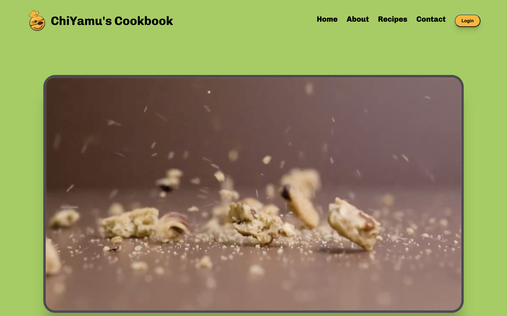

#### ChiYamu

###### Date Started: 04/03/2024

###### Last Updated: 06/04/2024

###### Deployment: Netlify

###### Get Started with React: [what to do ?](https://github.com/fullstacktutorials/install-reactjs)

###### Partner: [Zuribaby](https://github.com/Zuribaby)

---

###### Tech Stack: ReactJS HTML5 & CSS

---

##### Welcome to ChiYamu! If you're here, you're checking out how to make your own react recipe app and you can rest assured that you come to the right place. Feel free to explore our work, it was a fun collaboration and remember, the code is yours to adapt and use however you like. Enjoy!

---

---

###### Features:
##### - **Routing**: The application uses `react-router-dom` for routing. It has two routes: the main page which renders the `RecipesList` component, and the recipe detail page which renders the `RecipeDetail` component.
##### - **Hero Video**: The application includes a `HeroVideo` component that plays three different videos in a loop with a fade transition effect.
##### - **Login Form**: The `Header` component includes a login form with validation for the username, email, and password.
##### - **Smooth Scrolling**: The `Header` component includes navigation links that use smooth scrolling to navigate to different sections of the application.
##### - **Recipe List**: The `RecipesList` component displays a list of recipes. Each recipe includes a title and description, and the title is a link that navigates to the detail page of the recipe.

###### Process:
##### The application was built using ReactJS. The `App` component is the main component of the application, and it defines the routes for the application. The `HeroVideo` component plays three different videos in a loop with a fade transition effect. The `Header` component includes a login form and navigation links that use smooth scrolling. The `RecipesList` component displays a list of recipes.

###### Learnings:
##### Building this application provided valuable experience in using ReactJS and `react-router-dom` for routing. It also provided practice in using the `useState`, `useEffect`, and `useRef` hooks in React. The project also involved creating a login form with validation and implementing smooth scrolling for navigation links. Finally, it involved creating a list of recipes and a detail page for each recipe.

###### Points of Improvement: [in 6 months]

##### - **Responsiveness**: The application's responsiveness could be improved. Currently, it may not display optimally on all screen sizes and devices. One way to enhance the responsiveness is by using a CSS framework like Tailwind CSS. Tailwind CSS provides low-level utility classes that let you build completely custom designs without ever leaving your HTML. It's highly customizable and has excellent support for responsive design.

##### - **Login Functionality**: The login functionality could be enhanced. Currently, it provides basic validation for the username, email, and password. However, it could be improved by adding more sophisticated validation rules, error handling, and user feedback. Additionally, integrating a backend service for authentication could provide a more secure and robust login functionality.

##### - **Data Management**: The recipe details are currently hardcoded in the `RecipeDetail` component. This could be improved by storing the recipe details in a JSON file or a database. Then, the application could fetch the recipe details dynamically, which would make it easier to add, remove, or modify recipes. This would also separate the data from the view logic, making the code cleaner and easier to maintain.
